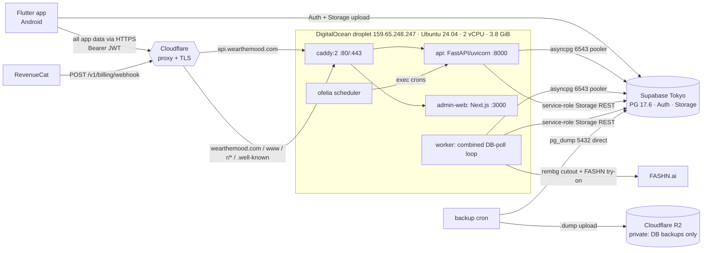

# DISCOVERY — Phase 0 (read-only)

> Verified map of the current Wear The Mood production system as of Phase 0.
> Source: repository at `98df3c3`, the live DigitalOcean droplet (read-only SSH), and read-only SQL against the live Supabase Tokyo project (via the droplet's own container env — no DSN handled locally).
> **No secret values appear here.** Secret variable **names** only. Subscription/project identifiers are redacted.
> DigitalOcean remains **live production**; nothing here changed application behavior.

---

## 1. Corrected believed-facts table

| # | Blueprint belief | Verified reality | Class |
|---|---|---|---|
| 1 | Deployment path `/root/fashionos` | ✅ Confirmed. Compose project `fashionos`, 5 services running. | Confirmed |
| 2 | API host `api.wearthemood.com`, apex `wearthemood.com`/`www` | ✅ All resolve to Cloudflare IPs (proxied); origin = droplet `159.65.248.247`. | Confirmed |
| 3 | DB region Supabase Tokyo `ap-northeast-1` | ✅ Confirmed (pooler region + DSN). PostgreSQL **17.6**. | Confirmed |
| 4 | **Media on Cloudflare R2** (no migration) | ❌ **FALSE.** `STORAGE_WRITES=legacy` → media writes to **Supabase Storage**. R2 is configured but holds only nightly **DB dumps**. | **Amendment (major)** |
| 5 | Admin console is **off-droplet** | ❌ **FALSE.** `admin-web` (Next.js standalone) runs **on the droplet**, routed by Caddy at `/mood-ops-console-7x9`. | **Amendment** |
| 6 | Six cron tasks (news, daily push, db backup, spend alert, credit reset, giveaway chat) | ✅ Confirmed exactly (ofelia labels). One **extra** unscheduled cron module `community.py` exists. | Confirmed + note |
| 7 | Try-on uses Supabase Realtime for status | ❌ Realtime publication has **0 tables**; the app **polls** the API. No Realtime dependency. | Amendment (simplifying) |
| 8 | Runtime on transaction pooler `6543` | ✅ Currently `6543` (`statement_cache_size=0`). Confirmed decision moves runtime to **Session Pooler 5432**; no requirement forces 6543. | Amendment (per decision) |

---

## 2. Current architecture

**Compute:** one droplet, `docker compose` project `fashionos`, 5 services: `api`, `worker`, `admin-web`, `caddy`, `ofelia`. Docker 29.5.3 / Compose v5.1.4. Images: `fashionos-worker` 4.92 GB, `fashionos-api` 4.15 GB, `fashionos-admin-web` 314 MB. Named volumes: `caddy-data`, `caddy-config`, `rembg-models` (~176 MB model cache — reproducible). Deploy is **file-sync** (not a git checkout). Firewall (ufw): 22/80/443. No non-Docker app services; no root crontab (scheduling is ofelia-only).

**API entrypoint:** `app.main:app` (uvicorn). Mounts `/v1/*` router + a root `/r/{code}` referral redirect + `/`. Middleware: RequestID, CORS. Uniform error contract (§13).

**Health:** only **`GET /v1/health`** (static: app/env/version/commit; no DB touch). **No `/healthz` or `/readyz`** yet → to be added in Phase 2 (§4.6); preserve `/v1/health` for back-compat.

**Worker:** single combined loop `python -m app.workers.worker`, polls the DB every 2 s and drains three queues in-process each tick: `requeue_stale` → `tryon_run_once` → `bg_run_once` → `ai_jobs_run_once`. **No Redis / Celery / broker — Postgres is already the source of truth** (DB-polling model). The migration adds Azure Queue **wake-signals** on top of this exact model.

---

## 3. Job model, claim, recovery, money paths

| Table | Status column | States (internal) | Claim | Stale-recovery |
|---|---|---|---|---|
| `wardrobe_items` | `cutout_status` | queued→processing→done \| failed | `FOR UPDATE SKIP LOCKED` | ✅ `requeue_stale` (>120 s → queued) |
| `tryon_jobs` | `status` | queued→processing→done \| failed | `FOR UPDATE SKIP LOCKED` | ❌ **none** |
| `ai_jobs` | `status` | queued→processing→**completed** \| failed | `FOR UPDATE SKIP LOCKED` | ❌ **none** |
| `wardrobe_items` | `ai_status` (enhance) | (enhancing)→done \| failed | — | ❌ **none** |

- **Claims already use `FOR UPDATE SKIP LOCKED`** — the exact primitive the target architecture wants (§4.2). Strong foundation.
- **Recovery gap:** only `wardrobe_items` cutout is auto-recovered. A crash mid `tryon_jobs`/`ai_jobs` leaves the row stuck in `processing` forever. → Phase 2 recovery task (§11.6) + DB reliability fields (attempt_count, lease ts) must cover all three job types.
- **External-state mapping needed (§4.5/§11.10):** internal states are inconsistent (`done` vs `completed`) and differ per table → add a backward-compatible `queued→preparing→processing→ready|failed` mapping at the API boundary.
- **Credits are idempotent (money-path SAFE):** `spend_credit` (reserve at submit) is idempotent on the job-id `ref` under a `FOR UPDATE` row lock; `refund_credit` is idempotent on `refund:{ref}`; `grant_credits` idempotent via `app_grant_credits(ref)`. Ledger = `credit_transactions` (immutable, per-bucket split in `meta`). **No double-charge / double-refund** even under duplicate processing.
- **Output-table uniqueness (§11.3):** `tryon_results` and `generated_images` have no visible `job_id` uniqueness. Safe **today** (no reprocessing happens, since tryon/ai jobs have no requeue), but the queue+recovery design introduces reprocessing → add terminal/output uniqueness before enabling recovery for those types.
- **Idempotency-Key** store (`idempotency_keys`, service-role only) guards job-creating/credit-spending endpoints (`(key,user_id,endpoint)`).

---

## 4. The six cron tasks (exact, from ofelia labels)

| Task | Ofelia schedule | Command | Notes |
|---|---|---|---|
| news | `@every 6h` | `python -m app.cron.news` | `NEWS_PROVIDER=rss` live |
| daily push | `@hourly` | `python -m app.cron.daily` | Hourly by design — sends only to users whose local hour == `DAILY_PUSH_HOUR` (§20) |
| database backup | `@daily` | `python -m app.cron.backup` | `pg_dump --format=custom` over **direct 5432** → private R2 `backups/<env>/<ts>.dump`, keep 7 |
| spend alert | `@every 6h` | `python -m app.cron.spend_alert` | Warns when 24 h AI spend ≥ `DAILY_COST_ALERT_USD` |
| credit reset | `@daily` | `python -m app.cron.credit_reset` | Monthly-grant backstop / no-rollover |
| giveaway chat cleanup | `@hourly` | `python -m app.cron.giveaway_chats` | Pickup-chat expiry + redaction |

- Ofelia (robfig/cron) semantics: `@hourly`=top of hour, `@daily`=00:00:00, `@every 6h`=interval from daemon start. Container TZ unset → **UTC**. Phase 4 converts each to five-field UTC cron (record deterministic clock times; don't assume `@daily` beyond 00:00 UTC).
- **Extra:** `backend/app/cron/community.py` (`python -m app.cron.community`, monthly community awards, idempotent per month) **exists but is NOT scheduled** by ofelia and is imported by no other module → orphaned/manual-only. Do **not** silently add it to Azure jobs; confirm intent with the founder.

---

## 5. Stateful-data map

| State | Location | Authoritative? | Migration handling |
|---|---|---|---|
| Application DB (59 tables, RLS 59/59, 67 policies, 197 funcs, 20 triggers, 7 seqs) | Supabase Tokyo PG 17.6, **19 MB** | ✅ yes | Phase 1 logical dump + Phase 3 restore to US |
| Auth (27 users: google 16, email 11) | Supabase Tokyo `auth.*` | ✅ yes | Dump must include `auth.users` + `auth.identities` (11 password hashes) |
| **Media (120 objects, ~72 MB)** | **Supabase Storage** (5 buckets) | ✅ **yes** | **NEW work:** copy Tokyo→US Storage + rewrite legacy absolute public URLs (see §7 amendment) |
| DB backups (`.dump`) | Cloudflare R2 private `backups/prod/` | Reproducible | Retain; not authoritative |
| rembg model cache | droplet volume `rembg-models` (~176 MB) | Reproducible | Bake into image at build (§11.4); no backup |
| Local pre-migration dumps `backups/prod/*.sql` | droplet local disk | Reproducible | Non-Git state; not authoritative |

Supabase Storage buckets: `wardrobe` (public, 56 obj/20 MB), `tryon-results` (private, 30/34 MB), `post-images` (public, 19/16 MB), `avatars` (private, 9/2 MB), `profile-pictures` (private, 6/0.6 MB). Extensions: `vector 0.8.0`, `pgcrypto`, `uuid-ossp`, `supabase_vault`, `pg_stat_statements`, `plpgsql` — all standard and supported on any Supabase project (no unsupported extension). Realtime publication `supabase_realtime` = **0 tables**.

---

## 6. Integration map (names/paths only)

| Integration | Where | Key/var names (no values) | Migration note |
|---|---|---|---|
| FASHN.ai (try-on, poll-based) | worker | `FASHN_API_KEY`, `FASHN_BASE_URL`, `FASHN_MODEL` | No webhook; poll model. Backend-only key. |
| RevenueCat | API | `REVENUECAT_WEBHOOK_AUTH` (+ `REVENUECAT_API_KEY`) | **Inbound webhook `POST /v1/billing/webhook`** (shared-secret) → must stay on `api.wearthemood.com`. |
| FCM push (live) | api/worker | `FCM_CREDENTIALS_JSON` (set), `PUSH_PROVIDER=fcm` | Service-account JSON secret. |
| OpenAI / Anthropic | worker/api | `OPENAI_API_KEY`, `ANTHROPIC_API_KEY`, model names | `LLM_PRIMARY=openai` in prod. |
| Sentry / PostHog | all | `SENTRY_DSN`, `POSTHOG_API_KEY`, `POSTHOG_HOST` | |
| Cloudflare R2 | worker/cron | `R2_ENDPOINT`, `R2_ACCESS_KEY_ID`, `R2_SECRET_ACCESS_KEY`, buckets, `R2_PUBLIC_BASE_URL` (cdn.wearthemood.com) | DB backups now; media target later. |
| Google OAuth | Supabase Auth (dashboard) + droplet `google_auth_id`/`google_auth_secret` | dashboard-config | Re-configure provider on new project (Phase 3, human). |

- **GitHub Actions secrets:** current `ci.yml` uses **no repo secrets** (lint+test only). Heroku/GHCR delivery secrets are added in Phase 2.
- **No runtime dependency on the raw droplet IP** — all traffic/webhooks use Cloudflare hostnames. (SSH-by-IP is ops-only.)
- **Dashboard-only config still to mirror in Phase 3 (human):** auth redirect URLs, SMTP, email templates, auth rate limits, provider enable toggles. Not exportable via API safely.

---

## 7. Direct-client split-brain result (§9.4 — CRITICAL)

**Result: LOW risk. The Flutter app has no direct database write path.**

- The app uses Supabase for **Auth** (`Supabase.instance.client.auth` — session/refresh/currentUser) and **Storage** only (client-side image uploads via `_client.storage.from(bucket)` to `wardrobe`, `avatars`, `profile-pictures`, `post-images`).
- **Zero** PostgREST/RPC access: no `.rpc(...)`, no `.from('table')` DB reads/writes anywhere in `app/lib`. All application data flows through **FastAPI** (`dio` client, Bearer JWT).
- **No in-app force-update / minimum-version gate exists** (verified: no such mechanism in the codebase).
- Distribution is limited (Play closed testing; iOS blocked) → few clients in the wild.

**Freeze proposal (verify + implement in Phase 3, reversible):**
1. **Natural JWT gate (primary):** the new US project signs JWTs with a different key (new projects default to asymmetric/JWKS). The API (`supabase_auth.py`) supports both HS256 and ES256/RS256 and caches its JWKS client per-URL. Once the API is repointed to US and restarted, **old Tokyo-signed tokens fail verification (401)** → old clients cannot perform authoritative writes (which only happen via the API). This is automatic and reversible (repoint back).
2. **Belt-and-suspenders reversible Tokyo freeze** during the final window: disable Tokyo Auth sign-ups and set Storage buckets read-only via RLS/grant changes (fully reversible) so stray old-client Auth logins / Storage uploads can't create orphaned Tokyo state.
3. **Operational:** coordinate the (small) closed-tester group to install the new build (re-login expected).

Residual after cutover: old clients could still hit Tokyo Auth/Storage directly, but with the API repointed those actions are inert (no authoritative DB write). **Not a blocker.**

---

## 8. Admin & static-route result (§9.7)

Both are **on the droplet** and need an owned target (Gate 0 decision):

| Route (Caddy) | Current | Proposed target |
|---|---|---|
| `api.wearthemood.com/*` | → `api:8000` | **Heroku `wtm-api-prod`** (custom domain) |
| `wearthemood.com/mood-ops-console-7x9*` | → `admin-web:3000` | **Heroku Eco `wtm-admin`** (Next.js standalone; preserve `FASTAPI_BASE_URL`→Heroku API, service-role secret, `ADMIN_IP_ALLOWLIST`) — fallback scale-to-zero ACA if Heroku incompatible |
| `wearthemood.com/r/*` | → `api:8000` (referral redirect, DB write) | **Cloudflare route → Heroku API** (must stay dynamic) |
| `/.well-known/apple-app-site-association`, `/.well-known/assetlinks.json` | static (`/srv/site`) | **Cloudflare Pages** (preserve exact paths + JSON content-type) |
| `/`, `/legal/*` (privacy/terms/acceptable-use), `/invite/`, `/delete-account.html` | static (`/srv/site`, from repo `deploy/site/`) | **Cloudflare Pages** |

Recommendation: **admin → Heroku Eco `wtm-admin`** (shares the Eco pool, cheapest, keeps server-side service-role off the client), **static site (`deploy/site/`) → Cloudflare Pages**, **`/r/*` → Heroku API** via Cloudflare route.

---

## 9. Risks & blockers

**No hard blockers.** Blueprint §3.5 immediate-blocker checklist:

| Check | Result |
|---|---|
| Redis / unlisted stateful service | ✅ none |
| LISTEN/NOTIFY relied on for correctness | ✅ none (only app-level "notify user" wording) |
| session advisory locks | ✅ none |
| authoritative files on droplet not in Supabase/R2 | ✅ none (model cache + local dumps are reproducible) |
| direct mobile writes to Tokyo without freeze plan | ✅ no direct DB writes; freeze plan feasible (§7) |
| source DB too large for target tier | ✅ 19 MB DB + 72 MB storage → fits Free comfortably |
| unsupported extensions | ✅ all standard/supported |
| non-idempotent worker ops | ✅ credits idempotent; output-uniqueness + tryon/ai recovery to add in Phase 2 |
| credits/refunds double-execute | ✅ idempotent on ref |
| admin/landing routes stranded | ⚠️ on droplet — target proposed (§8), resolve at Gate 0 |
| cannot produce restorable backup | ✅ DB+Storage both exportable/restore-testable |

**Target amendments to approve:**
1. **(Major) Supabase Storage media migration.** Media lives in Supabase Storage (not R2). Phase 3 must copy ~120 objects/~72 MB Tokyo→US **and** rewrite stored absolute **public-bucket** URLs to the new project ref (private buckets self-heal via read-time signing once the backend repoints). Add to `SUPABASE_CUTOVER_RUNBOOK.md`.
2. **Admin placement** → Heroku Eco `wtm-admin` (Gate 0 decision).
3. **Static site + `/r/*`** → Cloudflare Pages + Heroku-API route (Gate 0 decision).
4. **Job reliability (Phase 2):** add attempt/lease/last-signal fields + recovery for `tryon_jobs`/`ai_jobs`/`wardrobe_items.ai_status`; add output-row uniqueness; add external-state mapping (`done`/`completed`→`ready`).
5. **Runtime DSN** → Session Pooler **5432** (per confirmed decision; no requirement forces 6543; `statement_cache_size=0` is compatible with both).
6. **Non-blocking notes:** CI red = formatting only (tests pass 580/2-skip); `community.py` cron unscheduled; extra droplet env keys not read by config (`PHOTOROOM_API_KEY`, `REMOVE_BG_API_KEY`, `BG_REMOVAL_PROVIDER`, `OPENAI_MODEL_FALLBACK`, `google_auth_id/secret`).

**Deferred to their phases (need human/token, not Phase-0 blockers):** live Cloudflare config export (DNS record JSON, page/redirect rules, R2 CORS/lifecycle, exact R2 object inventory) needs the CF/R2 token → Phase 1 backup; Supabase dashboard auth/SMTP/template/redirect mirror → Phase 3.

---

## 10. Backup-volume & tier-fit estimates (§9.8)

- **DB logical dump:** ~19 MB source → dump a few MB (custom/plain). Restore-testable locally.
- **Media backup:** ~**120 objects / ~72 MB** in Supabase Storage → ~120 copy operations. Trivial.
- **R2 today:** private bucket holds nightly `.dump` files only (retain).
- **Total backup footprint:** < ~100 MB, ~120–130 object operations.
- **Target Supabase tier fit:** 19 MB DB + 72 MB storage + 27 users vs Free (0.5 GB DB / 1 GB storage / 50k MAU) → **comfortable fit on Free** during migration; Pro is a later human launch task.

---

## 11. Test & CI status

- **Backend suite: `580 passed, 2 skipped`** (582 collected) — run locally in an isolated venv (`pytest -q`, ~137 s). Money paths (credits/idempotency/billing/moderation) covered.
- **Flutter suite:** ~579 `test(`/`testWidgets(` across 117 files (static). Full run needs `build_runner` codegen → exercised in Phase 2 CI.
- **CI on `main` is RED — formatting only:** backend fails at `ruff format --check .`, Flutter at `dart format --set-exit-if-changed .`; **both fail before the test step runs**, so tests never executed in CI (they pass locally). Pre-existing hygiene drift on `main`, unrelated to migration and out of Phase 0 scope. Flag to founder; the Phase 2 build workflow will account for it.
