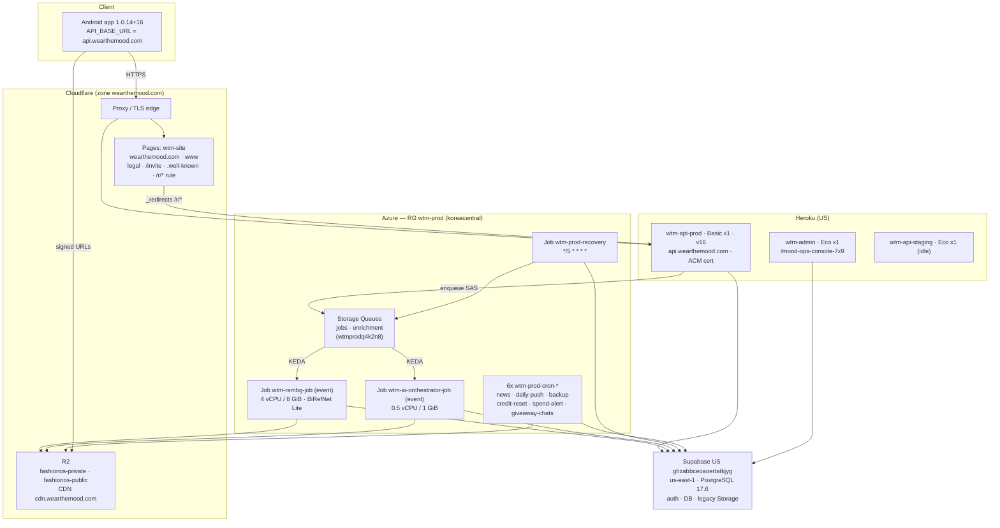

# INFRASTRUCTURE INVENTORY — Wear The Mood

> Live architecture as verified **2026-07-26** (Phase 7 pre-deletion audit).
> Names, IDs and digests only — no secret values.
> Supersedes the DigitalOcean topology in `DEPLOY_DIGITALOCEAN.md`, `CLAUDE.md` §2 and `render.yaml`,
> all of which are **stale** and describe decommissioned infrastructure.

---

## 1. Runtime topology

## 2. Component register

| Component | Provider | Identifier | Spec | Notes |
|---|---|---|---|---|
| Production API | Heroku | `wtm-api-prod` | Basic ×1, container stack, US | v16, commit `78e7040`; 45 config vars |
| API custom domain | Heroku + Cloudflare | `api.wearthemood.com` | CNAME → `synthetic-castle-…herokudns.com`, proxied | ACM cert `melanorosaurus-27035`, **expires 2026-10-18** |
| Admin console | Heroku | `wtm-admin` | Eco ×1 | `/mood-ops-console-7x9` → 307 → `/login` |
| Staging API | Heroku | `wtm-api-staging` | Eco ×1 | idle; sleeps when unused |
| Website | Cloudflare Pages | `wtm-site` | prod branch `main` | domains `wtm-site.pages.dev`, `wearthemood.com`, `www.wearthemood.com` |
| Object storage | Cloudflare R2 | `fashionos-private`, `fashionos-public` | — | `STORAGE_WRITES=r2`; CDN `cdn.wearthemood.com`; staging buckets also exist |
| Database / auth | Supabase | `ghzabbceoaoertatkjyg` | us-east-1, PG 17.6, Free tier | authoritative; Tokyo project retained cold |
| Legacy media | Supabase Storage | 5 buckets, 684 objects | — | serves 43 pre-R2 wardrobe rows |
| Queue | Azure Storage | `wtmprodq4k2n8` → `jobs`, `enrichment` | Standard_LRS | Heroku enqueues via an add-only SAS |
| Background removal | Azure ACA Job | `wtm-rembg-job` | event, 4 vCPU / 8 GiB, parallelism 1, maxExec 1, `REMBG_BATCH_MAX_JOBS=1` | `wtm-rembg-worker@sha256:ae266423…`, `BG_MODEL=birefnet-general-lite` |
| AI orchestrator | Azure ACA Job | `wtm-ai-orchestrator-job` | event, 0.5 vCPU / 1 GiB | `wtm-orchestrator@sha256:1625c973…` |
| Recovery | Azure ACA Job | `wtm-prod-recovery` | `*/5 * * * *` | re-signals stranded rows |
| Scheduled jobs | Azure ACA Jobs | `wtm-prod-cron-news` `0 */6 * * *` · `-daily-push` `0 * * * *` · `-backup` `0 0 * * *` · `-credit-reset` `0 0 * * *` · `-spend-alert` `0 */6 * * *` · `-giveaway-chats` `0 * * * *` | replicaTimeout 1800 | replaced ofelia |
| Emergency API | Azure Container App | `wtm-prod-api-emergency` | 0→1, guarded off | no route |
| Registry | GHCR | `ghcr.io/getrabbi/*` | — | canonical; no Azure Container Registry |
| CI | GitHub Actions | `ci`, `migration-build`, `migration-deploy` | — | env `production` holds Heroku creds |
| Mobile CI | Codemagic | app `wear-the-mood` | — | iOS compile-check; `API_BASE_URL` from env group |
| Push | Firebase FCM | project `fashionos-3d779` | — | server-initiated from Heroku + Azure |
| Payments | RevenueCat | webhook → `api.wearthemood.com` | — | `REVENUECAT_WEBHOOK_AUTH` on Heroku |

## 3. DigitalOcean — decommissioned

| Item | State |
|---|---|
| Droplet `577335646` (`fashion-os`, nyc3, 159.65.248.247) | **All containers stopped 2026-07-26T18:47:58Z, `restart=no`. Awaiting deletion.** |
| Firewalls `fashionos`, `fashionos1` | attached to the droplet; become orphaned on deletion (free) |
| Project `fashionos` | becomes empty (free) |
| Droplet `568022411` (`ubuntu-s-1vcpu-1gb-nyc1`, 165.22.12.123) | **Unrelated to Wear The Mood — leave alone.** The only separately billable DO resource. |
| Snapshots / volumes / reserved IPs / LBs / DO DNS / Spaces / registry / monitoring / uptime | **none exist** |

## 4. Documents known to be stale

| Document | Problem |
|---|---|
| `DEPLOY_DIGITALOCEAN.md` | describes the decommissioned deploy path (`ssh` → file-sync → `docker compose up`) |
| `CLAUDE.md` §2 | "Backend hosting = DigitalOcean droplet (docker-compose)" — now Heroku + Azure |
| `render.yaml` | already marked not-active; Render was never live |
| `docker-compose.yml` | the droplet's compose file; retained for local development only |

These are left in place deliberately — rewriting the product blueprint is out of scope for the
decommission audit — but **this file is authoritative** for infrastructure questions.
